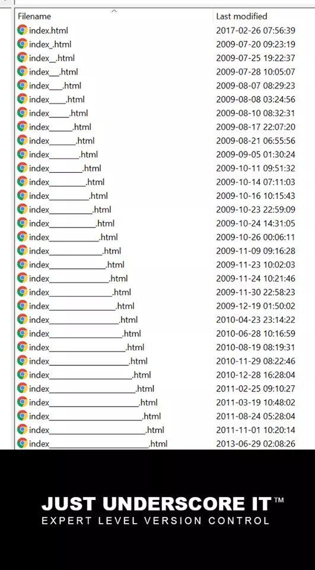
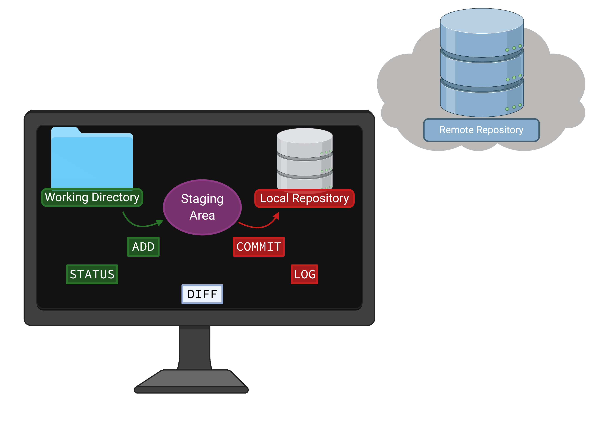
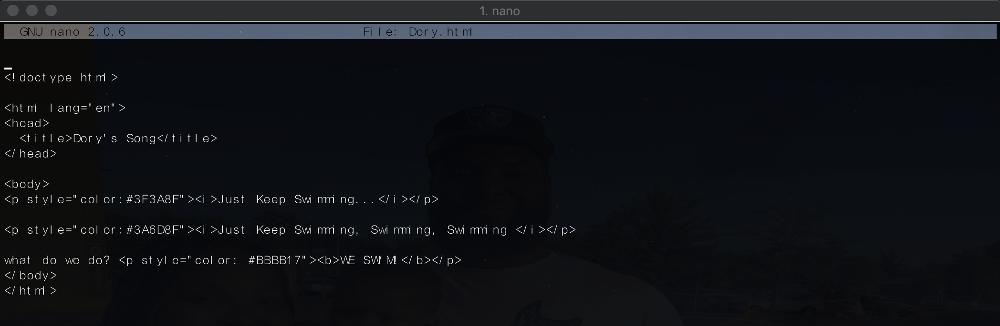
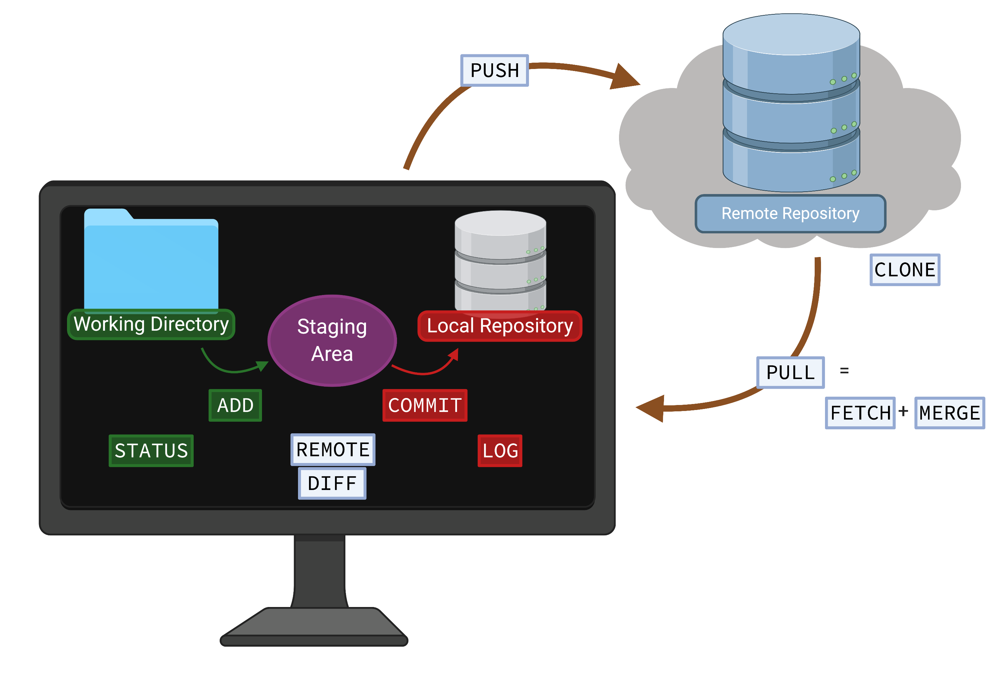

# <font size="30">Reproducibility and Version Control</font> {data-background="#C0F19B73"}

## Reproducibility in Science {data-background="#fdf6e3"}

<p style="font-size:65%;">From a [review](https://setac.onlinelibrary.wiley.com/doi/pdfdirect/10.1002/ieam.4212) on [<u>Reproducibility and Replicability in Science</u>](https://research.uci.edu/compliance/human-research-protections/researchers/2019%20-%20NAS%20-%20Reproducibility%20and%20Replicability%20in%20Science.pdf) by the <i>Committee on Replicability and  Reproducibility in Science of the National Academies of Sciences, Engineering, and Medicine</i>:</p>

>- Reproducibility <i>"...obtaining consistent results using the same input data, computational steps, methods,code, and conditions of analysis."</i>
>- Replicability <i>"...obtaining consistent results across studies aimed at answering the same scientific question, each of which has obtained its own data."</i>
>- More about the ["Reproducibility Crisis in Science"](https://www.nature.com/articles/d41586-019-00067-3)

## Version Control {data-background="#fdf6e3"}

<div style="text-align: left; float: left; padding: 150px 0;font-size: 50%">
<p data-markdown>- How do you manage versions of documents and code?
- Do you remember the changes in each version?
- What about working code that hits a snag after edits?
<p style="font-size:40%">[Version Control Humor Source](https://www.reddit.com/r/ProgrammerHumor/comments/9p44w7/most_portable_version_control_system/)</p>
</p>

</div>

<div style="text-align: right; float: right;">


</div>

## {data-background="#fdf6e3"}


<p style="font-size:40%">[Version Control Humor Source](https://me.me/i/who-would-wir-most-advanced-version-control-system-used-to-19855373)</p>

>- <p style="font-size:65%;text-align:center">Use a <b>Version Control System</b> </p>

## <font size="30"> Version Control & Reproducible Science </font> {data-background="#fdf6e3"}

>- <p style="font-size:65%"> Version Control Systems (VCS) tracks content, providing an entire history of changes</p>
>- <p style="font-size:65%"> VCS like [Git](https://git-scm.com/) allow code and text files to be shared in full</p>
>- <p style="font-size:65%"> Develop and debug portions of a project, integrate the changes into working code later</p>

# Intro to Git {data-background="#C0F19B73"}

## Version Control with Git {data-background="#fdf6e3"}
What is [`git`](https://www.edureka.co/blog/what-is-git/)?

>- Modern free and open source version control system
>- Developed by the creator of Linux OS
>- Manages and track change to code and text files
>- Aids in reproducibility and transparency 

## <font size="30">Basic Workflow</font> {data-background="#fdf6e3"}

<p style="font-size:30%"><i>Created with BioRender.com</i></p>

## Git Setup {data-background="#fdf6e3"}

Check for `git`

```
$ git --version
```

>- <p style="font-size:65%;color:#2E86C9">This command should print your version of `git` (i.e., `git version 1.7.1`)</p>

>- <p style="font-size:65%;color:#2E86C9">If you reach an error (i.e.,`-bash: git: command not found`), <i>you need to [install `git`](https://git-scm.com/) </i></p>


## {data-background="#fdf6e3"}
Let's personalize some basic settings in `git`

```
git config --list
```

>- <p style="font-size:65%;color:#2E86C9">This command should print your current configuration settings and aliases </p>

## {data-background="#fdf6e3"}

You may or may not have configured settings, but here are <b>some essential ones...</b>

```
git config --global user.name "Amanda D. Clark"
git config --global user.email "adc0032@auburn.edu"
git config --global core.editor "nano -w"
git config --global color.ui true
```

>- <p style="font-size:65%;color:#2E86C9">Use `git config -h` for more options and settings.</p> 

## {data-background="#E1BDE4"}
<div style="margin:15px;font-size:175%;"><b>Creating a New Local Repository</b></div>

## <font size="10">Git command `git init`</font> {data-background="#fdf6e3"}

<p style="font-size:55%;"> Make a course directory </p>
```
$ mkdir IntrotoCompBio
$ cd IntrotoCompBio
$ mkdir repo1
$ cd repo1
```
<p style="font-size:55%;">Let's make a repository for the course...</p>
```
$ git init
Initialized empty Git repository in /home/adc0032/IntrotoCompBio/repo1.git/
```
>- <p style="font-size:65%; color:#2E86C9"> `git` will now be aware of content in the <span style="color:#29732A;"> working directory</span> (tracked and untracked) </p>

## <font size="10">Git command `git add`</font> {data-background="#fdf6e3"}

<p style="margin:10px;font-size:55%;"> Let's give `git` content to track...</p>

```
$ echo "Just keep Swimming..." > Dory.txt
$ git add Dory.txt
```
>- <p style="font-size:65%; color:#2E86C9"> This content is now <span style="color:#8F3A84;"> staged </span> to be tracked </p>


## <font size="10">Git command `git status`</font> {data-background="#fdf6e3"}

<p style="font-size:55%;"> Let's see what content is being tracked and/or managed...</p>

```
$ git status

On branch master

No commits yet

Changes to be committed:
  (use "git rm --cached <file>..." to unstage)

	new file:   Dory.txt
```
>- <p style="font-size:65%;color:#2E86C9"> No <span style="color:#C71E1E;">commits</span>, but we do have new content in the <span style="color:#8F3A84;"> staging area </span>.</p>


## <font size="10">Git command `git commit`</font> {data-background="#fdf6e3"}

<p style="font-size:55%;"> Let's commit staged content and changes to our local repository...</p>

```
$ git commit
```

<p style="font-size:55%;"> Add a summary of changes made in the commit message, save, and exit the text editor...</p>


```
$ git commit
[master (root-commit) 8566e3b] Adding Dory's song
 1 file changed, 1 insertion(+)
 create mode 100644 Dory.txt
```

>- <p style="font-size:65%;color:#2E86C9"><b> This was the first snapshot of the <span style="color:#29732A;"> working directory </span> stored in the <span style="color:#C71E1E;">local repository</span>! </b></p>


## <font size="10">Git command `git diff`</font> {data-background="#fdf6e3"}

<p style="font-size:55%;">Let's see if there are any changes that haven't been staged...</p>

```
$ git diff
```
<p style="font-size:55%;">What happened?</p>

```
$ echo "Just Keep Swimming, Swimming, Swimming" >> Dory.txt

$ git diff 
diff --git a/Dory.txt b/Dory.txt
index 4353455..53fb00b 100644
--- a/Dory.txt
+++ b/Dory.txt
@@ -1 +1,2 @@
 Just keep Swimming...
+Just Keep Swimming, Swimming, Swimming
```
>- <p style="font-size:65%;color:#2E86C9"> `git` found changes to the working directory that haven't been staged yet!</p>
>- <p style="font-size:65%;color:#2E86C9"> Let's go ahead and stage a commit.</p>

## {data-background="#fdf6e3"}

```
$ git add Dory.txt
#We forgot to add the last part! Let's edit the file we just staged

$ echo 'What do we do? We Swim!' >> Dory.txt
```
>- <p style="font-size:65%;color:#2E86C9">Run `git diff` again. What happens?</p>
>- <p style="font-size:65%;color:#2E86C9">What about if you run `git diff --staged`?</p>
>- <p style="font-size:65%;color:#2E86C9">Let's stage and commit all changes now.</p> 

## <font size="10">Git command `git log`</font> {data-background="#fdf6e3"}

<p style="font-size:55%;">Let's review what `git` has done...</p>

```
$ git log
commit e40bf73c567d1b8881795a8450667b8b30673970 (HEAD -> master)
Author: Amanda D. Clark <adc0032@auburn.edu>
Date:   Sun Aug 16 17:33:46 2020 -0500

    Added the final lines of Dory's song.

commit 8566e3bde8e7aa9428e7614f7917b2ae9d4f137e
Author: Amanda D. Clark <adc0032@auburn.edu>
Date:   Sat Aug 15 02:20:41 2020 -0500

    Adding Dory's song
```
>- <p style="font-size:65%;color:#2E86C9">There are many elements here, but this is a log of changes we have made and asked `git` to track</p>
>- <p style="font-size:65%;color:#2E86C9">This is essentially your lab notebook!</p> 

## Back to the Basics {data-background="#fdf6e3"}

- <p style="color:#2E86C9"> Remember: </p>

`git add`   
`git status`   
`git commit`

- <p style="font-size:65%;color:#2E86C9">Stage and Commit Often!</p> 
- <p style="font-size:65%;color:#2E86C9">The commit message is your friend.</p> 


# Branches in Git {data-background="#C0F19B73"}

## <font size="10">Branches</font> {data-background="#fdf6e3"}

>- <p style="font-size:65%">Contribute another dimension to efficient workflows</p>
>- <p style="font-size:65%">Useful for experimental code and new developments</p>
>- <p style="font-size:65%">Changes to branches are independent of the "master" branch</p>

## <font size="10">Git command: `git branch`</font> {data-background="#fdf6e3"}

<p style="font-size:55%;"> Let's see what branches we have of our repository...</p>

```
$ git branch
```
```
$ git branch
* master
```
>- <p style="font-size:65%;color:#4B614B;">We only have one branch, our master</p>
>- <p style="font-size:65%;color:#4B614B;">The asterisk indicates current branch</p>

## {data-background="#fdf6e3"}
<p style="font-size:55%;">Now let's make a couple of new branches...</p>

```
$ git branch develop
$ git branch test
```
>- <p style="font-size:65%;color:#4B614B;">Run `git branch` again. How is it different from before?</p>
>- <p style="font-size:65%;color:#4B614B;">How do you get from branch to branch?</p>

## <font size="10">Git command: `git checkout`</font> {data-background="#fdf6e3"}

<a href="https://imgflip.com/i/4bva9m"></a><div style="font-size: 20%"><a href="https://imgflip.com/memegenerator">from Imgflip Meme Generator</a></div>

<p style="font-size:55%;">Let's manipulate the develop branch...</p>

```
$ git checkout develop
M	Dory.txt
Switched to branch 'develop'
```
>- <p style="font-size:65%;color:#4B614B;">Run `git branch` again. What has changed?</p>
>- <p style="font-size:65%;color:#4B614B;">`ls` the working directory of the "develop" branch</p>
>- <p style="font-size:65%;color:#4B614B;">Edits, stages, and commits here are specific to the develop branch. Let's test this...</p>

## {data-background="#fdf6e3"}

<p style="font-size:55%;"> Let's sprinkle in little HTML code on our song...</p>

- <p style="font-size:65%;color:#4B614B;">Populate Dory's song into this [html template]() and save as "Dory.html"</p>
<div style="text-align: center; float: center"></div>

>- <p style="font-size:65%;color:#4B614B;">What has changed about your directory content (Check with `ls` and `git status`)?</p>
>- <p style="font-size:65%;color:#4B614B;">Go ahead and commit these modifications to the repository (Quiz)</p>

## <font size="10">Git command: `git merge`</font> {data-background="#fdf6e3"}

<p style="font-size:55%;"> Let's incorporate changes in the development branch into the master branch...</p>

```
$ git checkout master
Switched to branch 'master'

$ git merge develop
Updating e40bf73..edb4f1f
Fast-forward
 Dory.html | 16 ++++++++++++++++
 Dory.txt  |  1 +
 2 files changed, 17 insertions(+)
 create mode 100644 Dory.html
```

>- <p style="font-size:65%;color:#4B614B;">We just merged our content and histories from "develop" into "master"</p>
>- <p style="font-size:65%;color:#4B614B;">What does our working directory and "master" branch look like now?</p>
>- <p style="font-size:65%;color:#4B614B;">We have new files, why don't we have anything to commit?</p>

## <font size="10">Branches: A Review</font> {data-background="#fdf6e3"}

>- <p style="font-size:65%;color:#4B614B;">Branches are extremely useful for making changes to existing content, particularly when publically available. </p>
>- <p style="font-size:65%;color:#4B614B;">Move between branches with `git checkout`</p>
>- <p style="font-size:65%;color:#4B614B;">Remember `git diff`? Try comparing two branches (test vs master)</p> 
>- <p style="font-size:65%;color:#4B614B;">Changes on the branch didn't work out? Use the `git branch` option `-d` to delete the branch</p>

# Remote Repositories {data-background="#C0F19B73"}

## <font size="10">Remotes</font> {data-background="#fdf6e3"}

- <p style="font-size:65%">A version of your local repository hosted elsewhere (i.e., Internet)</p>
- <p style="font-size:65%">Often is read-only accessible or read-write accessible to one person (typically, the creator)</p>
- <p style="font-size:65%">A way to make your final products and code available to the public</p>

## <font size="30">Basic Workflow</font> {data-background="#fdf6e3"}

<p style="font-size:30%"><i>Created with BioRender.com</i></p>


## <font size="10">Git command: `git clone`</font> {data-background="#fdf6e3"}

<p style="font-size:55%;">Existing repositories can be copied and set up for remote access...</p>

```
$ git clone <url or directory>
```

>- <p style="font-size:65%;color:#934B6E;">Makes a local repository that is a clone of the repository at the give address</p>
>- <p style="font-size:65%;color:#934B6E;">Automatically makes a remote connection to the given address under the alias "origin"</p>

## <font size="10">Git command: `git remote`</font> {data-background="#fdf6e3"}

<p style="font-size:55%;">Manage remote repositories with `git remote`</p>

```
$ git remote -v
```

- <p style="font-size:65%;color:#934B6E;">Here you are asking `git` to list your remote connections</p>
>- <p style="font-size:65%;color:#934B6E;">`-v` means verbose, and will print the remote alias and address </p>

```
$ git remote add <alias> <url or directory>
```
- <p style="font-size:65%;color:#934B6E;">Here you are asking `git` to set up a remote connection to a given address under a specific alias</p> 

## <font size="10">Git command: `git pull`</font> {data-background="#fdf6e3"}

<p style="font-size:55%;">Getting content from a remote repository...</p>

```
$ git pull <alias> <branch>
# often the command is simply origin master
$ git pull origin master
```
- <p style="font-size:65%;color:#934B6E;">`git pull` is actually two commands that incorporates remote content locally</p>
>- <p style="font-size:65%;color:#934B6E;">`git fetch` which grabs content from the remote repository</p>
>- <p style="font-size:65%;color:#934B6E;">`git merge` which merges remote content with your local repository</p>
>- <p style="font-size:65%;color:#934B6E;">The two commands (`fetch merge`) are useful for when you want to inspect content before merging</p>

## <font size="10">Git command: `git push`</font> {data-background="#fdf6e3"}

<p style="font-size:55%;">Sending content to a remote repository...</p>

```
$ git push origin master
```
- <p style="font-size:65%;color:#934B6E;">We are asking `git` to send a snapshot of our local repository content to the "master" branch of the remote repository named "origin"</p>
>- <p style="font-size:65%;color:#934B6E;">Keep your local repository up-to-date with `git pull`</p>
>- <p style="font-size:65%;color:#934B6E;">Let's see a remote repository in action...</p>

## {data-background="#fdf6e3"}

<iframe width="1120" height="630" src="https://www.youtube.com/embed/N_WXrnpDIOI" frameborder="0" allow="accelerometer; autoplay; encrypted-media; gyroscope; picture-in-picture" allowfullscreen></iframe>

## <font size="10">Collaboration with Git and GitHub</font> {data-background="#fdf6e3"}

- <p style="font-size:65%;color:#934B6E;">[GitHub](https://github.com/) is one host of public and private remote code repositories ([SourceForge](https://sourceforge.net/) is another example)</p>
>- <p style="font-size:65%;color:#934B6E;">GitHub also provides a GUI for interacting with a repository</p>
>- <p style="font-size:65%;color:#934B6E;">GitHub repositories can be accessed in a CLI using `git clone <github url for repository>`</p>

- <p style="font-size:65%;color:#934B6E;">Public Repositories can be Forked on GitHub</p>
>- <p style="font-size:65%;color:#934B6E;">Forking is similar to `git clone` on the command line</p>
>- <p style="font-size:65%;color:#934B6E;">Users can make edits or revisions to public code to submit back to the creator or to make something novel</p>

## <font size="10">Best Practices for Shared Repositories</font> {data-background="#fdf6e3"}

>- <p style="font-size:65%;color:#934B6E;">`git pull` frequently to ensure the most up-to-date state of the repository</p>
>- <p style="font-size:65%;color:#934B6E;">Make sure to add meaningful messages for your collaborators!</p>
>- <p style="font-size:65%;color:#934B6E;">`git commit` and `git push` often to reduce merging conflicts. (Remember to `git pull` first!)</p> 


# Resources {data-background="#C0F19B73"}
## Git Resources {data-background="#fdf6e3"}

[Git Documentation](https://git-scm.com/docs)

[Learning Git](https://www.atlassian.com/git)

# Acknowledgements {data-background="#C0F19B73"}
## Inspiration {data-background="#fdf6e3"}

<p style="font-size:65%">This presentation was adapted from [Dr. Jamie Oaks'](http://phyletica.org/people/) [Intro to Git](http://phyletica.org/slides/git-intro/#/)</p> 

## Funding {data-background="#fdf6e3"}

This presentation was made possible by funding to Amanda Clark from NSF GRFP (1414475) and Auburn University